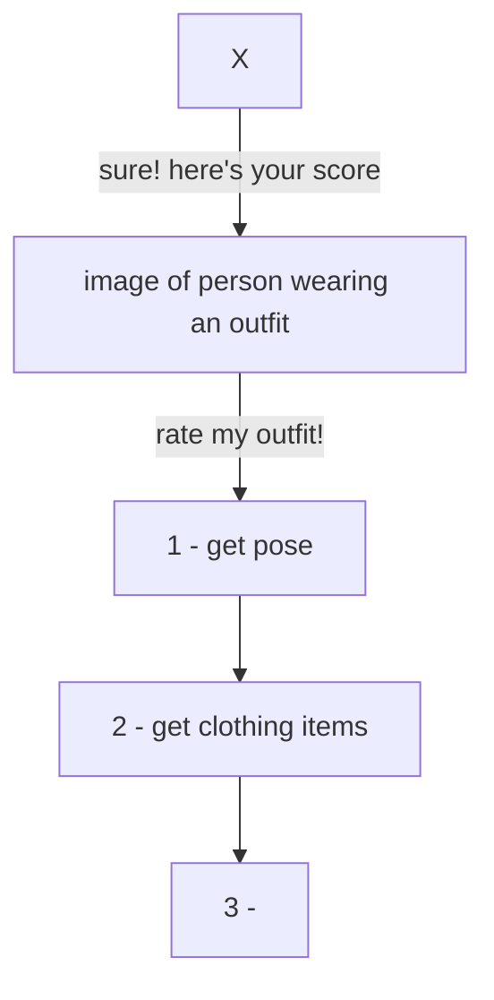

# FHV Master Thesis
by Viktoriia Simakova

## Data:
* Clothing Co-Parsing (CCP) Dataset
* Pinterest

### Pinterest:
[Developers Website](https://developers.pinterest.com/)
[Dokumentation](https://developers.pinterest.com/docs/getting-started/set-up-authentication-and-authorization/)

## Flow:
