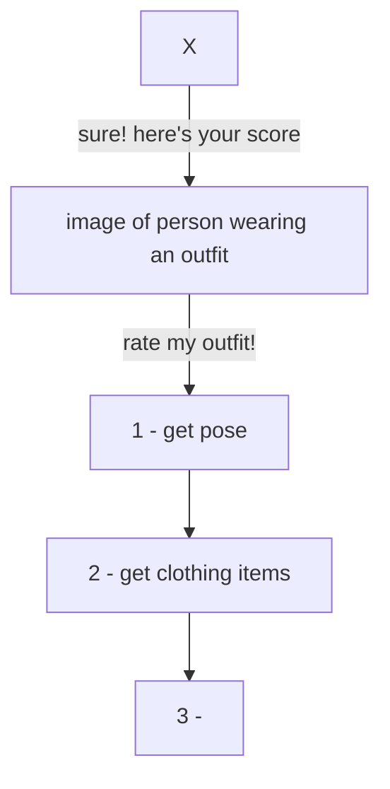

# FHV Master Thesis
by Viktoriia Simakova

## Data:
* Clothing Co-Parsing (CCP) Dataset
* Pinterest

### Pinterest:
[Developers Website](https://developers.pinterest.com/)
[Dokumentation](https://developers.pinterest.com/docs/getting-started/set-up-authentication-and-authorization/)


## Models:
``` bash
!git clone 'https://github.com/facebookresearch/segment-anything.git'
!pip install supervision
%cd segment-anything
```

Checkpoints for SAM (vit-h):
``` bash
!wget -q https://dl.fbaipublicfiles.com/segment_anything/sam_vit_h_4b8939.pth
```

Checkpoints for SAM (vit-l):
``` bash
!wget -q https://dl.fbaipublicfiles.com/segment_anything/sam_vit_l_0b3195.pth
```

Checkpoints for SAM (vit-b):
``` bash
!wget -q https://dl.fbaipublicfiles.com/segment_anything/sam_vit_b_01ec64.pth
```


## Flow:
